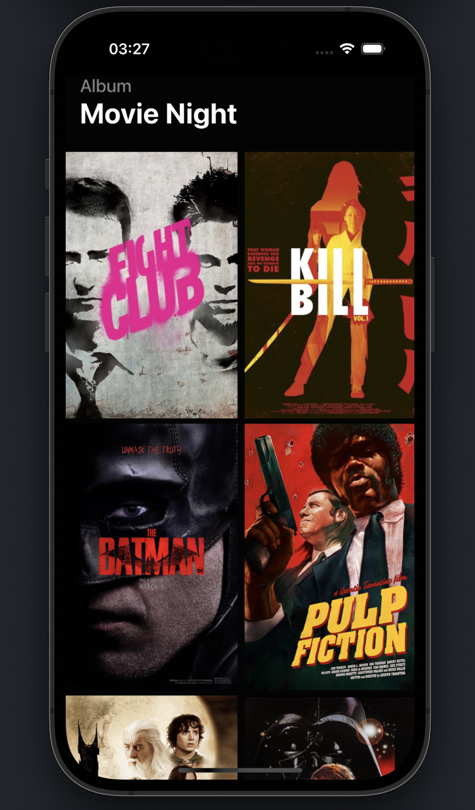
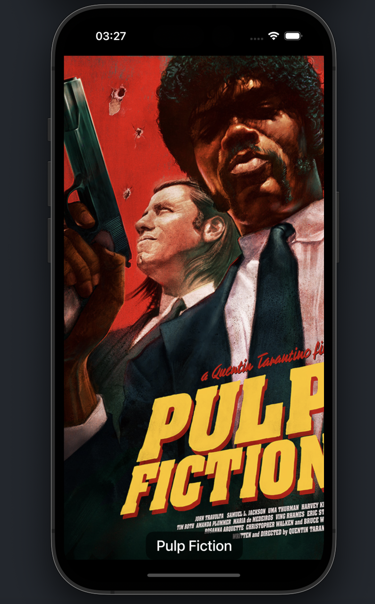

## Movie Gallery

Movie gallery created with Swift to put SwiftUI studies into practice / Galeria de filmes criada com Swift para colocar em prática estudos com o SwiftUI

## Screenshots

  
  

## Requisitos

1. Xcode 14.0

## Como rodar o projeto
1. Clone este repositório
2. Instale as ferramentas de desenvolvimento: `brew bundle && bundle install`
3. Selecione o target `MovieGallery` e execute o aplicativo no simulator

## Tecnologias Utilizadas

Swift & SwiftUI

## Autores

